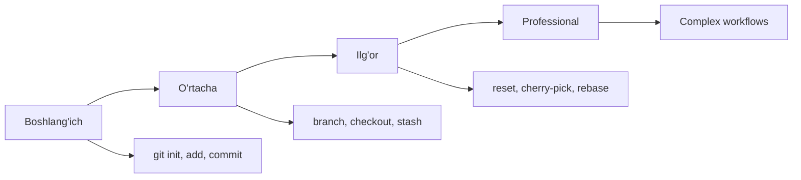

# 🚀 Git Command Trainer

Terminal shaklida interaktiv Git komandalarini o'rganish platformasi! Real vaqtda Git komandalarini mashq qiling va professional developer bo'ling.


## 🎮 Demo

**[O'yinni Boshlash →](https://Makhmud-egp.github.io/git-command-trainer/)**

## ✨ Xususiyatlar

- 💻 **Terminal Interface** - Real terminal ko'rinishi va his
- 🎯 **10 ta Amaliy Vazifa** - Boshlang'ich dan ilg'or darajagacha
- 💡 **3 daraja Hint System** - Qiyin bo'lganda yordam olish
- ⚡ **Real-time Feedback** - Darhol natija ko'rish
- 📊 **Progress Tracking** - O'z natijangizni kuzatib boring
- 🎨 **Matrix Theme** - Zamonaviy hacker dizayni
- ⌨️ **Keyboard Support** - Enter bosib submit qilish
- 🏆 **Achievement System** - Mukofotlar va darajalar

## 🎓 O'rganish Jarayoni

### Level 1-3: Boshlang'ich
- Repository yaratish (`git init`)
- Fayllarni staging qilish (`git add`)
- Birinchi commit (`git commit`)

### Level 4-6: O'rtacha
- Branch bilan ishlash (`git branch`, `git checkout`)
- Stash funksiyasi (`git stash`)
- Remote bilan ishlash

### Level 7-10: Ilg'or
- Tag yaratish (`git tag`)
- Reset komandasi (`git reset --soft`)
- Cherry-pick (`git cherry-pick`)

## 💻 Qanday O'ynash

1. **Stsenariyni O'qing** - Vazifa tavsifi beriladi
2. **Komandani Kiriting** - Terminal'ga Git komandasi yozing
3. **Submit/Enter** - Javobni yuborish
4. **Hint** - Qiyin bo'lsa, 💡 tugmasini bosing
5. **Skip** - O'tkazib yuborish mumkin (lekin tavsiya etilmaydi!)

```bash
# Misol
$ git init
✅ Ajoyib! Repository yaratildi. .git folder paydo bo'ldi.
💡 Pro Tip: git init - eng birinchi komanda...
```

## 🏆 Baholash Tizimi

| Natija | Daraja | Tavsif |
|---------|--------|--------|
| 100% (hint = 0) | 🏆 PERFECT SCORE | Mutlaq mukammal! |
| 80-100% | 🌟 EXCELLENT | Juda yaxshi bilasiz! |
| 60-79% | ✨ GOOD JOB | Yaxshi natija! |
| < 60% | 📚 KEEP LEARNING | Amaliyot davom eting! |

## 🛠️ Texnologiyalar

- **HTML5** - Tuzilma
- **CSS3** - Styling
  - Matrix theme (qora + yashil)
  - Terminal animatsiyalari
  - Glow effects
  - Responsive design
- **Vanilla JavaScript** - Mantiq
  - Command parsing
  - Hint system
  - Progress tracking
  - Achievement logic

## 📦 O'rnatish

### Local ishga tushirish

```bash
# Repository'ni clone qiling
git clone https://github.com/your-username/git-command-trainer.git

# Papkaga kiring
cd git-command-trainer

# Brauzerda oching
open index.html
```

### GitHub Pages'ga Deploy

```bash
# Git'ni boshlang
git init
git add .
git commit -m "🚀 Initial commit: Git Command Trainer"

# GitHub'ga push qiling
git remote add origin https://github.com/your-username/git-command-trainer.git
git branch -M main
git push -u origin main

# Settings → Pages → Source: main branch → Save
# 2-3 daqiqa kutib, saytingiz tayyor!
```

## 📂 Fayl Tuzilishi

```
git-command-trainer/
├── index.html          # Asosiy fayl (HTML + CSS + JS)
├── README.md           # Dokumentatsiya
└── LICENSE             # MIT License
```

## 🎨 Customization

### Yangi Level Qo'shish

`index.html` faylidagi `scenarios` massiviga qo'shing:

```javascript
{
    title: "Level X: Sizning Vazifangiz",
    description: "Vazifa tavsifi...",
    correctCommand: "git your-command",
    alternatives: [
        "git your-command",
        "git alternate-command"
    ],
    hints: [
        "Birinchi hint",
        "Ikkinchi hint",
        "Oxirgi hint"
    ],
    successMessage: "✅ Barakalla!",
    tips: "Pro tip matni..."
}
```

### Ranglarni O'zgartirish

```css
/* Asosiy ranglar */
--terminal-bg: #000;
--terminal-text: #00ff00;
--accent-color: #ffff00;

/* Sizning ranglaringiz */
--terminal-bg: #1a1a1a;
--terminal-text: #00ffff;  /* Cyan */
--accent-color: #ff00ff;   /* Magenta */
```

### Terminal Button Colors

```css
.terminal-button.red { background: #ff5f56; }
.terminal-button.yellow { background: #ffbd2e; }
.terminal-button.green { background: #27c93f; }
```

## 🎯 O'rganish Yo'lagi

Ushbu trainer sizga quyidagilarni o'rgatadi:

1. ✅ Git'ning asosiy tushunchalari
2. ✅ Repository boshqaruvi
3. ✅ Branch strategiyalari
4. ✅ Stash va Tag
5. ✅ Reset va Cherry-pick
6. ✅ Remote bilan ishlash
7. ✅ Production deployment
8. ✅ Best practices

## 💡 Pro Tips

- Har doim `git status` tekshirib turing
- Commit message'lar aniq va qisqa bo'lsin
- Branch'larni muntazam yangilab turing
- Stash'ni unutmang - juda foydali!
- Tag'lar production uchun majburiy

## 🤝 Contributing

Loyihani yaxshilashga hissa qo'shing!

```bash
# 1. Fork qiling
# 2. Branch yarating
git checkout -b feature/awesome-feature

# 3. Commit qiling
git commit -m "✨ Add awesome feature"

# 4. Push qiling
git push origin feature/awesome-feature

# 5. Pull Request oching
```

## 📚 Qo'shimcha Resurslar

- [Git Documentation](https://git-scm.com/doc)
- [GitHub Guides](https://guides.github.com/)
- [Atlassian Git Tutorials](https://www.atlassian.com/git/tutorials)
- [Git Cheat Sheet](https://education.github.com/git-cheat-sheet-education.pdf)

## 🐛 Bug Report

Xatolik topsangiz:

1. GitHub Issues'da yangi issue oching
2. Xatolik tavsifini yozing
3. Screenshot qo'shing (agar kerak bo'lsa)
4. Qaysi brauzerde bo'lganini yozing

## 🗺️ Roadmap

- [ ] Ko'proq levellar (20+ vazifa)
- [ ] Difficulty settings (Easy/Medium/Hard)
- [ ] Timer mode - vaqt bilan raqobat
- [ ] Multiplayer mode
- [ ] Leaderboard
- [ ] Certificate generator
- [ ] Git branching visualizer
- [ ] Code playground integration
- [ ] Mobile app version
- [ ] Telegram bot integration
- [ ] English version

## 📜 License

MIT License - erkin foydalaning va o'zgartiring!

## 👨‍💻 Muallif

**Makhmud**

- GitHub: [@Makhmud-egp](https://github.com/Makhmud-egp)
- Email: osonpy@gmail.com
- Telegram: @osonpython
- LinkedIn: [Makhmud Djalolov](https://www.linkedin.com/in/makhmud-djalolov-8928b332b/)

## 🙏 Minnatdorchilik

- Git jamoasiga - ajoyib tool uchun
- Anthropic Claude - README yozishda yordam berdi
- Barcha contributorlarga - hissa qo'shganlar uchun

## ⭐ Star History

Agar loyiha foydali bo'lsa, ⭐ star bosishni unutmang!

[](https://starchart.cc/Makhmud-egp/git-command-trainer)

---

<div align="center">

**Made with ❤️ and ☕ in Uzbekistan 🇺🇿**

[⬆ Yuqoriga qaytish](#-git-command-trainer)

</div>

## 📱 Screenshot

```
┌─────────────────────────────────────────┐
│ ● ● ●                                   │
│                                         │
│   🚀 GIT COMMAND TRAINER                │
│                                         │
│   Level: 5    To'g'ri: 4    Hint: 2    │
│   ████████████████░░░░░░░░░░░ 50%      │
│                                         │
│   Level 5: Branch'ga O'tish             │
│   feature/login branch'ga o'ting.       │
│                                         │
│   $ git checkout feature/login_         │
│                                         │
│   [Submit]  [Skip]  [💡 Hint]          │
└─────────────────────────────────────────┘
```

## 🎓 Learning Path



---

**P.S.:** Git o'rganish - bu sayohat, manzil emas. Davom eting! 🚀
